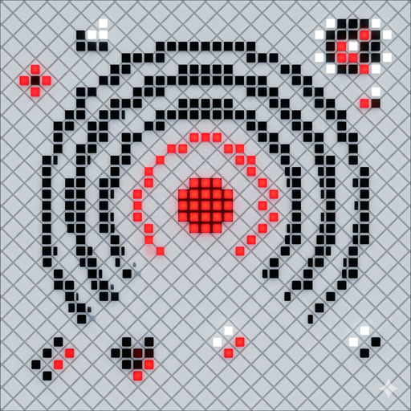

<p align="center">
  <picture>
    <source media="(prefers-color-scheme: dark)" srcset="apk/icon_dark.png">
    <source media="(prefers-color-scheme: light)" srcset="apk/icon.png">
    
  </picture>
</p>

# Nothing AirShare & Sync ⚪️⚫️

**Seamless file sharing and bidirectional clipboard sync between iOS, macOS, and Nothing OS—without custom iOS apps.**

*Featuring a custom, minimalist Nothing OS-inspired dot-matrix adaptive icon designed with transparency. It dynamically inverts between light and dark themes to fit perfectly in your browser or phone launcher! Showcasing open-source collaboration and creative interface design.*

[](https://github.com/Raul909/Nothing-Air-Share/releases/latest/download/NothingAirShare.apk)

<p align="center">
  <a href="https://github.com/Raul909/Nothing-Air-Share/releases/latest"></a>
  
  
  <a href="https://github.com/Raul909/Nothing-Air-Share/stargazers"></a>
</p>

---

## ✨ Why Nothing AirShare?

Apple keeps AirDrop and Universal Clipboard locked to Apple devices — so your **Nothing Phone** gets left out. Nothing AirShare bridges that gap by using your Mac as a quiet relay: **nothing to install on your iPhone**, a lightweight companion app on your Nothing Phone, and everything running **locally over your own Wi‑Fi** — no cloud, no account, no telemetry.

- 🍎🤝⚫️ **Bridges Apple ↔ Nothing** — reuses native AirDrop + Universal Clipboard; zero setup on iOS
- 📋 **Instant two‑way clipboard** — copy on your Mac, paste on your phone (and back) — text *and* images
- 📁 **Effortless file sharing** — drag into a folder or use the Share Sheet; files auto‑sort into Pictures / Documents / Downloads
- 🖱️ **Phone as a trackpad + media remote** — steer your Mac's cursor and playback wirelessly
- 🔔 **Find My Phone**, 🌙 **Focus / DND sync**, and 🔋 **live battery** right in the menu bar
- 🔒 **Private by design** — 100% local, PIN‑protected transfers, fully open source
- ⚫️ **Premium Nothing OS aesthetic** — a dot‑matrix menu‑bar app with a custom adaptive icon

> New here? Jump straight to **[Install the Android app](#-install-the-android-companion-app)** and **[Install the macOS daemon](#️-install-the-macos-sync-daemon)**.

---

## ⚡️ Ecosystem Architecture

```
                           ┌──────────────────┐
                           │     MacBook       │
                           │  (Menu Bar ⚫️)    │
                           │  Custom Popover  │
                           │  unified_sync.py │
                           └─────────┬────────┘
                                     │
                 ┌───────────────────┼──────────────────┐
                 │                   │                  │
          Wireless ADB         Wi-Fi Direct       Apple Native
        (Background Sync)      (P2P Sockets)     (AirDrop + UC)
                 │                   │                  │
    ┌────────────▼───────┐           │       ┌───────────▼──────────┐
    │   Nothing Phone    │◄──────────┘       │   iPhone / iPad      │
    │                    │                   │                      │
    │  NothingAirShare   │                   │  No app required —   │
    │  Companion App     │                   │  uses native AirDrop │
    │  (APK v2.8.0)      │                   │  & Universal         │
    │                    │                   │  Clipboard           │
    └────────────────────┘                   └──────────────────────┘
```

**Three components, one seamless loop:**

| Component | What It Does |
|---|---|
| **Android APK** | Native clipboard listener, Share Sheet integration, P2P file sender, card-grid dashboard with trackpad & media remote, Find Phone ring receiver |
| **macOS Daemon** | Menu bar popover with premium Nothing OS dark/red styling, manages ADB stream, clipboard bridge, Bonjour discovery, TCP command/file server, AirDrop forwarder |
| **iOS** | Zero setup — Apple's native AirDrop and Universal Clipboard flow through the Mac automatically |

---

## 📲 Install the Android Companion App

### Option A — Direct Download (Recommended)
1. Download the latest version to your phone:

   [](https://github.com/Raul909/Nothing-Air-Share/releases/latest/download/NothingAirShare.apk)

   **Previous Version:**
   [](https://github.com/Raul909/Nothing-Air-Share/releases/download/v2.7.1/NothingAirShare.apk)

2. Open the downloaded file on your Nothing Phone
3. Tap **Install** (you may need to allow "Install from unknown sources" for your browser)
4. Open **Nothing AirShare** once to activate background clipboard sync

### Option B — Install Over ADB from Mac
Once the Mac daemon is running and connected (see below):
1. Click the `⚫️` menu bar icon to open the popover
2. Select **Connect ADB** if not connected
3. Install the APK wirelessly — open it on your phone once

---

## 🖥️ Install the macOS Sync Daemon

### Prerequisites
- macOS 12 Monterey or later
- [Homebrew](https://brew.sh) installed
- Python 3.9+

### Step-by-Step Installation

**1. Install ADB (Android Debug Bridge)**
```bash
brew install android-platform-tools
```

**2. Clone this repository**
```bash
git clone https://github.com/Raul909/Nothing-Air-Share.git ~/Nothing-Air-Share
```

**3. Create a Python virtual environment and install dependencies**
```bash
cd ~/Nothing-Air-Share
python3 -m venv .venv && source .venv/bin/activate
pip install pyobjc-framework-Cocoa pyobjc-framework-Quartz pyobjc-framework-Accessibility pyobjc-framework-ApplicationServices watchdog Pillow
```

**4. Launch the daemon**
```bash
python3 unified_sync.py
```

A **Nothing Dot (`⚫️`)** will appear in your Mac's menu bar. Click it to open the Popover panel!

---

## 🔗 Connect Your Nothing Phone

### First-Time Pairing (One-Time Setup)

**On your Nothing Phone:**
1. Go to **Settings > System > Developer options** (If you don't see it, go to *About phone > Software info* and tap *Build number* 7 times to enable it).
2. Enable **Wireless Debugging** and tap into it.
3. Tap **Pair device with pairing code** — note the `IP:Port` (e.g. `192.168.x.x:4XXXX`) and the 6-digit Wi-Fi pairing code.

**On your Mac (Visual App Flow):**
1. Click the `⚫️` menu bar icon -> click **Connect ADB** at the bottom.
2. Select **Pair Device**.
3. Enter the `IP:Port` and the 6-digit pairing code shown on your phone, then click **Pair**.
4. Once successfully paired, a notification will appear, and you can connect!

*(Alternatively, you can run `adb pair <IP>:<PORT>` in your Mac Terminal and enter the code there).*

### Connecting & Handshake (After Pairing)

Once paired, connecting is fully automated:
1. Turn on **Wireless Debugging** on your Nothing Phone.
2. Within seconds, the Mac app will automatically discover your phone's connection port and run `adb connect` in the background.
3. The menu bar dot will turn solid white (`⚪️`), and the Popover panel will show **Connected**.

*If automatic connection does not trigger, you can connect manually:*
- Click `⚫️` -> click **Connect ADB** -> select **Connect** -> enter your phone's Wireless Debugging `IP:Port` (shown on the main Wireless Debugging screen).

---

## 📖 How to Use

### 📋 Clipboard Sync
| Direction | How |
|---|---|
| **Mac → Phone** | Copy anything on your Mac (`Cmd+C`) — it's instantly pushed to your phone's clipboard. Alternatively, click the **Clipboard** card in the Mac Popover to force sync. |
| **Phone → Mac** | Copy text on your phone — it appears on your Mac clipboard within ~600ms |
| **iPhone → Phone** | Copy on iPhone → Universal Clipboard syncs to Mac → Mac forwards to phone |
| **Clipboard History** | Click `⚫️` menu bar → View **Clipboard History** list in the popover → click any of the last 3 items to restore and push to phone |

### 📁 File Sharing
| Direction | How |
|---|---|
| **Mac → Phone** | Drag any file into `~/NothingDrop` on your Mac — it's automatically pushed to the phone. Or click **Send Files** in the popover to pick a file. |
| **Phone → Mac** | Tap **Share** on any file → choose **Nothing AirShare**, or open the app and tap **SEND FILES** |
| **Phone → Mac (P2P)** | Open app → see your Mac under **Nearby Devices** in the drawer → tap **SEND** → pick file |
| **Mac → Phone (P2P)** | Click `⚫️` → click **Send File** next to your phone under **Nearby Devices** → pick a file to send |
| **iPhone → Phone** | AirDrop a file from iPhone to Mac — the daemon auto-forwards it to your phone |
| **Phone → iPhone** | After receiving a file from phone, click the Popover and choose to AirDrop to iOS |

### 📱 Find My Phone
Click the **Find Phone** card on the Mac popover dashboard. This will send a wireless broadcast to your Nothing Phone and trigger your system alarm sound out loud at maximum volume for 15 seconds so you can locate it instantly!

### ⚙️ Command Control
Click the **Commands** card on the Mac popover dashboard. You can trigger predefined system actions on your Mac, such as:
- **Lock Screen**: Puts Mac display to sleep immediately.
- **Toggle Dark Mode**: OS-wide appearance shift.
- **Open Terminal**: Launches macOS Terminal app.
- **Take Screenshot**: Triggers the screen capture tool.
- **Put Mac to Sleep**: Sleeps the machine safely.

### 📁 Smart File Routing (Phone → Mac)
Files pulled from your phone are automatically sorted:
| File Type | Destination |
|---|---|
| Images (`.jpg`, `.png`, `.heic`, etc.) | `~/Pictures/NothingDrop/` |
| Documents (`.pdf`, `.docx`, `.txt`, etc.) | `~/Documents/NothingDrop/` |
| Everything else | `~/NothingDrop/` |

All received files are indexed by **Spotlight** — find them instantly with `Cmd+Space`.

### 📱 Companion App Features
| Card | What It Does |
|---|---|
| **SEND FILES** | Opens the file picker to send a file to your Mac via Wi-Fi P2P or ADB |
| **CLIPBOARD SYNC** | Expands an inline text field — type and tap **COPY TO SYNC** to push to Mac |
| **REMOTE INPUT** | Opens a full-screen trackpad — control your Mac's cursor wirelessly (Requires Accessibility permission on Mac) |
| **MEDIA REMOTE** | Control Mac media playback (Play/Pause, Next, Previous) wirelessly |
| **☰ Drawer** | Slide open to see discovered nearby devices, settings, and about info |
| **⚙ Settings Overlay** | Customize options including: <br>• **Font Size Scaling**: Toggle SMALL, MEDIUM (default), or LARGE font scaling sizes globally in real-time. <br>• **⚙ Wireless Debugging Button**: Launches Android system Wireless Debugging / developer options panel. |

### 🌙 Focus Mode Sync
Toggle **Do Not Disturb** on your Mac → your Nothing Phone's DND / Zen Mode follows automatically.

---

## ⚙️ Keep It Running (Run on Mac Startup)

### Option A — LaunchAgent (Recommended)

This makes the daemon start automatically every time you log in and restart it if it crashes:

**Install:**
```bash
# Copy the LaunchAgent plist (edit paths if you cloned elsewhere)
cp ~/Nothing-Air-Share/com.nothing.clipboard-sync.plist ~/Library/LaunchAgents/

# Load it
launchctl bootstrap gui/$(id -u) ~/Library/LaunchAgents/com.nothing.clipboard-sync.plist
```

That's it — the `⚫️` dot will appear in your menu bar on every login.

**Check logs:**
```bash
# Stdout log
cat /tmp/nothing_clipboard_sync.log

# Error log
cat /tmp/nothing_clipboard_sync.err
```

**Uninstall / Stop:**
```bash
launchctl bootout gui/$(id -u) ~/Library/LaunchAgents/com.nothing.clipboard-sync.plist
rm ~/Library/LaunchAgents/com.nothing.clipboard-sync.plist
```

### Option B — Run Manually When Needed
```bash
cd ~/Nothing-Air-Share
source .venv/bin/activate
python3 unified_sync.py
```
Press `Ctrl+C` to stop. The `⚫️` dot disappears from the menu bar.

> **Why not a `.dmg`?**
> The macOS component uses `pyobjc` (Python-to-Cocoa bridge) and requires `adb` (Android platform tools). Bundling these into a standalone `.app` with PyInstaller/py2app produces a 200+ MB package that macOS Gatekeeper blocks without an Apple Developer Certificate ($99/yr for code-signing). The LaunchAgent approach is lighter, more transparent, and auto-updates when you `git pull`.

---

## 📋 Changelog

### v2.8.0 — Connection Stability, Menu Bar Sync & Latency Optimization

**Connection Stability**
- Fixed random socket drops caused by incomplete `recv()` reads — added reliable `recv_exact()` helper
- Android command socket (trackpad/media) now auto-reconnects with exponential backoff (3 retries)
- Added connection state lock to prevent race conditions between Bonjour auto-discovery and ADB monitor
- File transfer timeout now scales dynamically with file size (no more timeouts on large files)
- Android TCP server retries binding with backoff if port is occupied
- Socket errors are now surfaced to the Android UI with automatic reconnection

**Menu Bar Popover**
- Popover now auto-refreshes every 2 seconds while open (clipboard history, devices, battery update live)
- Clipboard history shows 3 items (was 2) — matches documentation
- Nearby devices shows up to 3 (was 2)
- Fixed memory leak from button maps growing without bound on each refresh
- Battery display no longer flickers from duplicate updates

**Latency Optimization**
- Phone→Mac clipboard sync reduced from ~2s to ~600ms (3.3× faster)
- Trackpad input uses binary protocol (9 bytes vs ~50 bytes JSON) with 16ms move coalescing for ~60fps
- `TCP_NODELAY` enabled on Mac TCP server — eliminates up to 200ms Nagle buffering
- File transfer buffers increased from 64KB to 256KB for better Wi-Fi throughput
- Removed redundant `dumpsys battery` ADB polling — uses real-time Android TCP broadcasts only
- Battery broadcasts debounced to 30s intervals to prevent socket storms
- Files sent from Android now stream directly from URI without cache copy (saves memory + storage)

---

## 🖤 Tribute
This project is an unofficial tribute to the design language of [Nothing](https://nothing.tech). All rights to "Nothing", NDOT typography, and aesthetics belong to Nothing.
