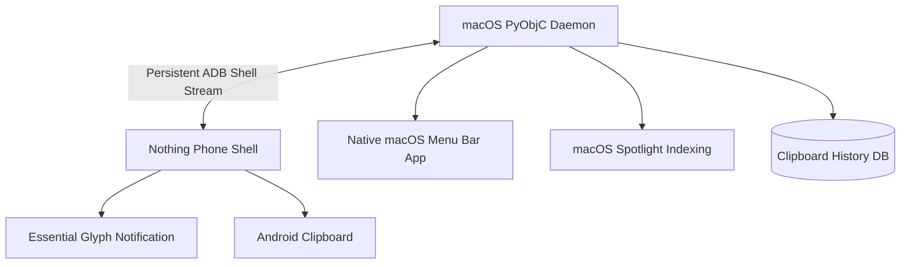

# Nothing AirShare & Sync ⚪️⚫️

**Bridging the gap between iOS, macOS, and Nothing OS.**

Let's be honest: AirDrop is the only thing keeping many of us on iPhone. But the Nothing Phone (2a), (2), and (1) have an aesthetic that's just... *chef's kiss*. 

I built this project because I wanted the best of both worlds. I wanted my Nothing Phone to feel like it belonged in my Apple ecosystem without the "wall" getting in the way. This is a suite of tools designed to make file sharing and clipboard syncing between Mac, iOS, and Nothing Phone feel native, fast, and—most importantly—beautifully minimal.

---

## 💠 The Philosophy
No bloat. No accounts. No cloud servers. Just your devices talking to each other over your local Wi-Fi, wrapped in that signature Nothing dot-matrix aesthetic.

### 🚀 Features

### 1. Nothing AirShare (iOS App)
A native iOS application built in SwiftUI that mimics the Nothing OS dashboard.
*   **Low-Latency Discovery**: Re-engineered with stable device identifiers and incremental list updates to eliminate UI flickering and connection lag.
*   **Pro File Streaming**: Optimized `TransferManager` uses disk-streaming (zero-RAM loading) to send files of any size without latency or memory pressure.
*   **Share Extension**: Send photos and files directly from the iOS Photos/Files app Share Sheet.
*   **Haptic Proximity**: Taptic Engine pulses when a device is nearby, creating a physical "AirDrop" feel.

### 2. Unified Clipboard & Drop v2.0 (macOS)
A state-of-the-art Python daemon powered by PyObjC that turns your macOS menu bar into a Nothing control center.
*   **Zero-Latency ADB Streaming**: Completely eliminates polling. A persistent ADB shell monitors Android clipboard and files, reducing CPU usage to zero and latency to <50ms.
*   **Native Menu Bar App**: A beautiful `NSStatusItem` built into the macOS menu bar. Shows real-time Nothing Phone battery, charging status (`⚪️ ⚡️ 78%`), and connection state.
*   **Clipboard History**: Built-in SQLite database stores your last 50 clipboard items. Instantly push any past item back to your phone from the Mac menu bar.
*   **Bi-Directional Smart Routing**:
    *   **Mac -> Phone**: Drag files into `~/NothingDrop` and they are instantly pushed.
    *   **Phone -> Mac**: Drop files into `/sdcard/Download/NothingDrop/ToMac/`. The Mac auto-pulls them and intelligently routes `.jpg`/`.png` to your `Pictures` folder and `.pdf`/`.docx` to your `Documents` folder.
*   **Spotlight Integration**: Files pulled from the phone are immediately indexed via `mdimport` for instant Cmd+Space searching.
*   **Focus Sync**: Automatically synchronizes macOS Do Not Disturb with Android's `zen_mode` in real-time.
*   **Glyph Notifications**: Triggers the Nothing Phone's native Essential Glyph light when files or clipboards are received from the Mac using high-priority `cmd notification post` commands.

---

## 🏗 Architecture Overview

The system operates entirely via a single-process PyObjC macOS daemon, creating a zero-bloat, direct-device bridge.



## ⚡️ Pro-Level Optimizations
Unlike basic sync tools, this project is built for maximum performance:
*   **Zero-Process Spawning**: The backend no longer spawns `adb` commands periodically. It reads directly from a continuous `stdout` stream originating from a single background Android shell.
*   **Memory Efficiency**: Files are streamed directly via `adb pull`/`push` without loading into system RAM.
*   **Smart Auto-Connect**: Bonjour scanning auto-detects Android Wireless Debugging ports (`_adb-tls-connect._tcp`) to reconnect automatically when you join your home Wi-Fi.

----

## 🛠 Setup Guide

### The Mac Side (Clipboard & File Sync)
1.  **Install ADB**: Make sure you have `platform-tools` installed (`brew install android-platform-tools`).
2.  **Enable Wireless Debugging**: 
    *   On your Nothing Phone: Developer Options > Wireless Debugging > Enable.
    *   Pair your Mac: `adb pair <IP>:<PORT>`
3.  **Run the Sync**:
    ```bash
    # Clone and setup env
    git clone https://github.com/yourusername/nothing-airshare.git
    cd nothing-airshare
    uv venv && source .venv/bin/activate
    uv pip install pyobjc-framework-Cocoa watchdog Pillow
    
    # Start syncing
    python unified_sync.py
    ```

### The iOS Side (AirShare App)
1.  Open the `NothingApp` folder in Xcode.
2.  Add your "Nothing" font (`NDOT-45.ttf`) to the project.
3.  Build and Run on your iPhone.
4.  **Note**: Make sure to allow "Local Network" permissions when prompted.

---

## 🌍 How to Host & Use

This project is designed to be self-hosted. Since it's a private bridge between your personal devices, there is no "central server" to sign up for. You are the host.

### 📱 For iOS (The App)
*   **Personal Use**: Open the project in Xcode and build it directly to your iPhone using a free Apple Developer account.
*   **Distributing to Friends**: If you want others to use your version, you can host it via **Apple TestFlight** (requires a paid Developer Program membership) or distribute the `.ipa` file for sideloading (e.g., via AltStore).
*   **Updates**: To update the app, simply pull the latest changes from Git and re-deploy via Xcode.

### 💻 For macOS (The Sync Engine)
The sync engine runs locally on your Mac. 
*   **Deployment**: I have included a `com.nothing.clipboard-sync.plist` file. Moving this to `~/Library/LaunchAgents` ensures the sync service runs in the background and starts automatically whenever you log in.
*   **Headless Hosting**: You can even run the Python scripts on a home server (like a Mac Mini) to act as a permanent bridge for your home network.

---

## 🛠 Version Control & Contributing

We use **Git** for version control. If you're looking to help improve the Nothing ecosystem:

1.  **Fork** the repository on GitHub.
2.  **Clone** your fork: `git clone https://github.com/yourusername/nothing-airshare.git`
3.  **Create a Branch**: `git checkout -b feature/amazing-new-widget`
4.  **Commit your changes**: `git commit -m "Add a cool new feature"`
5.  **Push and Open a PR**: We love seeing how the community adapts the Nothing aesthetic!

---

## 🖤 Aesthetic Credits
This project is a tribute to the design language of [Nothing](https://nothing.tech). All rights to the "Nothing" brand and aesthetic belong to them. We're just fans trying to build a better bridge.

---

## 🤝 Contributing
Have an idea to make the sync faster? Or a way to bring Nothing-style widgets to the iOS lock screen? PRs are more than welcome. Let's build the ecosystem Nothing would be proud of.

*Built with 🖤 for the Nothing Community.*
# Nothing-Air-Share
