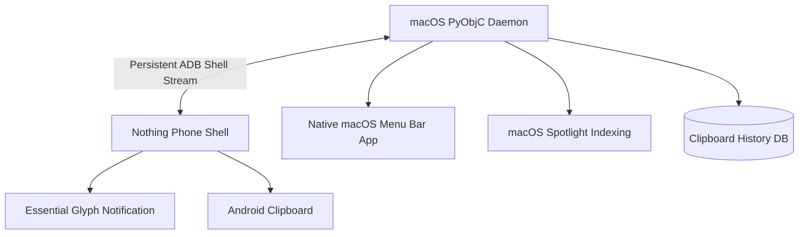

# Nothing AirShare & Sync ⚪️⚫️

**Bridging the gap between iOS, macOS, and Nothing OS.**

Let's be honest: AirDrop is the only thing keeping many of us on iPhone. But the Nothing Phone (2a), (2), and (1) have an aesthetic that's just... *chef's kiss*. 

I built this project because I wanted the best of both worlds. I wanted my Nothing Phone to feel like it belonged in my Apple ecosystem without the "wall" getting in the way. This is a suite of tools designed to make file sharing and clipboard syncing between Mac, iOS, and Nothing Phone feel native, fast, and—most importantly—beautifully minimal.

---

## 💠 The Philosophy
No bloat. No accounts. No cloud servers. Just your devices talking to each other over your local Wi-Fi, wrapped in that signature Nothing dot-matrix aesthetic.

### 🚀 Features

### 1. Nothing AirShare (iOS App)
A native iOS application built in SwiftUI that mimics the Nothing OS dashboard.
*   **Low-Latency Discovery**: Re-engineered with stable device identifiers and incremental list updates to eliminate UI flickering and connection lag.
*   **Pro File Streaming**: Optimized `TransferManager` uses disk-streaming (zero-RAM loading) to send files of any size without latency or memory pressure.
*   **Share Extension**: Send photos and files directly from the iOS Photos/Files app Share Sheet.
*   **Haptic Proximity**: Taptic Engine pulses when a device is nearby, creating a physical "AirDrop" feel.

### 2. Unified Clipboard & Drop v2.0 (macOS)
A state-of-the-art Python daemon powered by PyObjC that turns your macOS menu bar into a Nothing control center.
*   **Zero-Latency ADB Streaming**: Completely eliminates polling. A persistent ADB shell monitors Android clipboard and files, reducing CPU usage to zero and latency to <50ms.
*   **Native Menu Bar App**: A beautiful `NSStatusItem` built into the macOS menu bar. Shows real-time Nothing Phone battery, charging status (`⚪️ ⚡️ 78%`), and connection state.
*   **Clipboard History**: Built-in SQLite database stores your last 50 clipboard items. Instantly push any past item back to your phone from the Mac menu bar.
*   **Bi-Directional Smart Routing**:
    *   **Mac -> Phone**: Drag files into `~/NothingDrop` and they are instantly pushed.
    *   **Phone -> Mac**: Drop files into `/sdcard/Download/NothingDrop/ToMac/`. The Mac auto-pulls them and intelligently routes `.jpg`/`.png` to your `Pictures` folder and `.pdf`/`.docx` to your `Documents` folder.
*   **Spotlight Integration**: Files pulled from the phone are immediately indexed via `mdimport` for instant Cmd+Space searching.
*   **Focus Sync**: Automatically synchronizes macOS Do Not Disturb with Android's `zen_mode` in real-time.
*   **Glyph Notifications**: Triggers the Nothing Phone's native Essential Glyph light when files or clipboards are received from the Mac using high-priority `cmd notification post` commands.

---

## 🏗 Architecture Overview

The system operates entirely via a single-process PyObjC macOS daemon, creating a zero-bloat, direct-device bridge.



## ⚡️ Pro-Level Optimizations
Unlike basic sync tools, this project is built for maximum performance:
*   **Zero-Process Spawning**: The backend no longer spawns `adb` commands periodically. It reads directly from a continuous `stdout` stream originating from a single background Android shell.
*   **Memory Efficiency**: Files are streamed directly via `adb pull`/`push` without loading into system RAM.
*   **Smart Auto-Connect**: Bonjour scanning auto-detects Android Wireless Debugging ports (`_adb-tls-connect._tcp`) to reconnect automatically when you join your home Wi-Fi.

----

## 🛠 Setup & Connection Guide

Setting up your devices for the first time takes just a few minutes. Follow these simple steps to get everything running.

---

### Step 1: Prepare Your Nothing Phone (Android)

To allow your Mac to sync with your phone securely over Wi-Fi, you need to enable **Wireless Debugging**:

1. **Unlock Developer Options**:
   * On your Nothing Phone, go to **Settings** > **About phone** > **Software info**.
   * Find **Build number** at the bottom and tap it **7 times** in rapid succession.
   * You will see a toast notification saying: *"You are now a developer!"*
2. **Enable Wireless Debugging**:
   * Go back to **Settings** > **System** > **Developer options**.
   * Scroll down and toggle **ON** both **USB Debugging** and **Wireless Debugging**.
   * Click **Allow** when prompted.
3. **Get Your Pairing Details**:
   * Tap directly on the text **"Wireless Debugging"** to open its submenu.
   * Tap **Pair device with pairing code**.
   * Keep this screen open! You will see:
     * An **IP address & Port** (e.g., `192.168.1.100:37845` — *Note: this port is for pairing only!*)
     * A **Wi-Fi pairing code** (6-digit number).

> [!IMPORTANT]
> Make sure both your MacBook and your Nothing Phone are connected to the **same Wi-Fi network**.

---

### Step 2: Set Up Your Mac

1. **Install ADB (Android Debug Bridge)**:
   * Open your Mac's **Terminal** app (press `Cmd + Space`, type "Terminal", and hit Enter).
   * Install Homebrew (if you don't have it already) by pasting this command and pressing Enter:
     ```bash
     /bin/bash -c "$(curl -fsSL https://raw.githubusercontent.com/Homebrew/install/HEAD/install.sh)"
     ```
   * Install ADB by running:
     ```bash
     brew install android-platform-tools
     ```

2. **Clone this Project & Setup Python**:
   * In your Terminal, run the following commands to clone the code and install the required Python packages:
     ```bash
     # Navigate to your workspace (e.g., Documents)
     cd ~/Documents
     
     # Clone the repository
     git clone https://github.com/Raul909/Nothing-Air-Share.git
     cd Nothing-Air-Share
     
     # Create a virtual environment
     python3 -m venv .venv
     
     # Activate the environment
     source .venv/bin/activate
     
     # Install dependencies
     pip install pyobjc-framework-Cocoa watchdog Pillow
     ```

3. **Pair Your Mac & Nothing Phone**:
   * With the pairing screen still open on your Nothing Phone, run this command in your Mac's Terminal (replace with your phone's pairing IP and port):
     ```bash
     adb pair 192.168.1.100:37845
     ```
   * When prompted, enter the **6-digit Wi-Fi pairing code** shown on your phone's screen.
   * You should see a success message: *"Successfully paired to..."*

---

### Step 3: Run the App & Connect

1. **Start the Sync App**:
   * Run the sync daemon from your terminal:
     ```bash
     python unified_sync.py
     ```
   * Look up at your Mac's menu bar! You will see a new **black circle icon** (`⚫️`). This means the app is searching for your phone.
2. **Connect**:
   * On your Nothing Phone's Wireless Debugging screen, look at the **IP address & Port** listed under "IP address & Port" (e.g. `192.168.1.100:5555` — *Note: this port is usually different from the pairing port!*).
   * Click the **`⚫️`** icon in your Mac's menu bar.
   * Select **Connect Wireless ADB...**.
   * Enter your phone's IP address and Port (e.g., `192.168.1.100:5555`) and click **Connect**.
   * The menu bar icon will turn into a **white circle** (`⚪️`) and display your phone's battery level (e.g., `⚪️ 78%` or `⚪️ 78% ⚡️` if charging).

---

### Step 4: Run Automatically on Startup (Optional)

If you don't want to run this from the Terminal every time you start your Mac, you can configure it to run in the background automatically:

1. Open `com.nothing.clipboard-sync.plist` and make sure the paths inside match your actual installation folder.
2. Copy the plist file to your system LaunchAgents folder:
   ```bash
   cp com.nothing.clipboard-sync.plist ~/Library/LaunchAgents/
   ```
3. Load the daemon:
   ```bash
   launchctl bootstrap gui/$(id -u) ~/Library/LaunchAgents/com.nothing.clipboard-sync.plist
   ```
4. To stop it from running automatically in the future:
   ```bash
   launchctl bootout gui/$(id -u) ~/Library/LaunchAgents/com.nothing.clipboard-sync.plist
   ```

---

## 📱 Setting Up the iOS App (Nothing AirShare)

If you also want to use the iOS client to discover and transfer files between iOS and macOS/Nothing OS:

1. Open the `NothingApp` folder in **Xcode** on your Mac.
2. Download and add the **NDOT-45** font (`NDOT-45.ttf`) to your Xcode project to get the signature Nothing dot-matrix look.
3. Plug in your iPhone, select it as the target device in Xcode, and click **Build and Run** (`Cmd + R`).
4. Ensure you allow **"Local Network"** permissions when opening the app on your phone so it can discover other devices.

---

## 💡 Everyday Usage & Tips

Now that you're connected, here is how the magic works:

### 📋 Clipboard Synchronization
* **Text / Links**: Highlight and copy any text on your Mac (`Cmd + C`). It is instantly available to paste on your Nothing Phone (long-press -> Paste).
* **Copy History**: Click the `⚪️` menu bar icon on your Mac and hover over **Clipboard History** to see your last 50 copied items. Clicking any item puts it back onto your Mac's clipboard.
* **Images**: Copy an image on your Mac. It is sent straight to your phone and saved in your clipboard memory.

### 📁 Smart File Sharing (NothingDrop)
* **Mac to Phone**: Drag any file you want to share and drop it into the `~/NothingDrop` folder on your Mac. It is pushed directly to your phone's `Download/NothingDrop/` folder, and your phone will flash a Glyph light notification!
* **Phone to Mac**: Share any file on your Nothing Phone and save it into the `/sdcard/Download/NothingDrop/ToMac/` directory.
  * Your Mac instantly detects it, pulls it, and deletes the temporary copy on your phone to save space.
  * **Smart Routing**: Photos/Images automatically go to your Mac's `~/Pictures/NothingDrop/` folder. Documents/PDFs automatically go to `~/Documents/NothingDrop/`. Other files go to `~/NothingDrop/`.
  * The file is indexed automatically so you can search for it instantly using Spotlight (`Cmd + Space`).

### 🌙 Focus Mode Sync
* Toggle **Do Not Disturb** on your Mac. Your Nothing Phone will automatically turn on Do Not Disturb / Zen Mode. Toggle DND off, and your phone returns to normal.

---

## 🖤 Credits & Tribute

This project is a tribute to the design language of [Nothing](https://nothing.tech). All rights to the "Nothing" brand, NDOT typography, and aesthetics belong to Nothing. We are just developers who love their hardware and want a seamless bridge to our computers!

*Built with 🖤 for the Nothing Community.*

